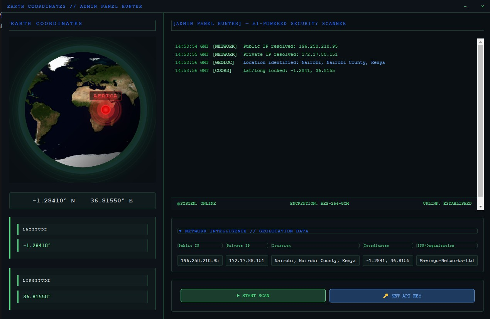
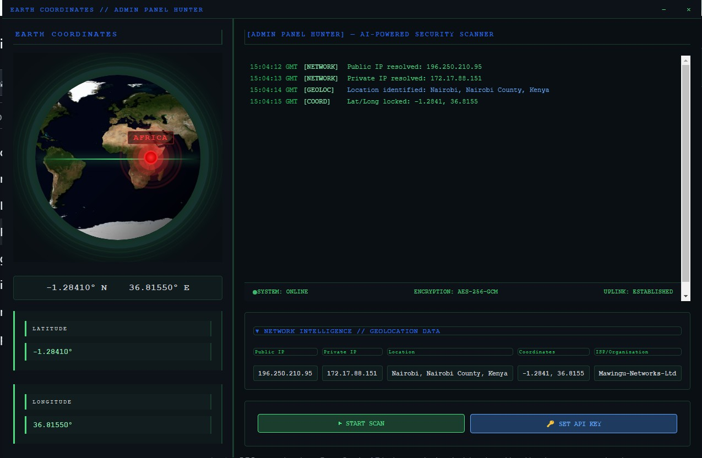

# Admin-crawler - AI-Powered Hidden Admin Panel Discovery Tool
This tool is a GUI‑based security scanner that automatically hunts for hidden admin panels on a target website. It uses intelligent path discovery (including CMS detection, AI‑assisted analysis and common wordlists) to locate administrative interfaces, then generates a detailed report with security findings and optional PDF export.


---

## Table of Contents

1. Overview
2. Features
3. System Requirements
4. Installation
5. Configuration
6. Usage Guide
7. Architecture
8. Screenshots
9. Wordlist Structure
10. API Integration
11. Troubleshooting
12. Security Notice
13. License

---

## Overview

Admin-Crawler is an advanced, AI-powered security assessment tool designed for penetration testers and security professionals to identify hidden administrative interfaces on web applications. The tool employs intelligent path discovery techniques including CMS detection, AI-assisted analysis, robots.txt parsing, sitemap extraction, and comprehensive wordlist scanning to locate administrative panels that may pose security risks.

The tool generates detailed security reports with findings, including HTTP status codes, login form detection, security header analysis, and optional PDF export functionality.

---

## Features

### Core Capabilities

| Feature | Description |
|---------|-------------|
| AI-Powered CMS Detection | Integrates DeepSeek API to identify content management systems from HTML analysis |
| Multi-Source Path Discovery | Combines wordlists, robots.txt, sitemap.xml, and CMS-specific paths |
| Intelligent Scanning | Rotates user agents and implements delays to avoid detection |
| Real-Time Results | Live terminal output with color-coded findings |
| Security Assessment | Evaluates security headers and detects login forms |
| PDF Reporting | Generates comprehensive PDF reports of all findings |
| Geolocation Visualization | Interactive Earth visualization with location-based continent mapping |

### Detection Methods

- **Wordlist Scanning**: Uses illusive.txt and CMS-specific wordlists
- **Robots.txt Analysis**: Extracts Disallow/Allow directives
- **Sitemap Parsing**: Discovers hidden URLs from XML sitemaps
- **AI Path Suggestions**: DeepSeek API suggests likely admin paths based on site structure
- **CMS Fingerprinting**: Identifies WordPress, Joomla, Laravel, Drupal, and custom CMS

### Output Formats

- Real-time terminal display with timestamped logs
- JSON report data structure
- PDF report with security assessment
- Console output for immediate findings

---

## System Requirements

### Minimum Requirements

| Component | Requirement |
|-----------|-------------|
| Operating System | Windows 10/11, Linux (Ubuntu 20.04+), macOS 11+ |
| Processor | Dual-core 2.0 GHz |
| RAM | 4 GB |
| Disk Space | 200 MB |
| Python Version | 3.8 or higher |
| Network | Internet connection for API calls and scanning |

### Recommended Requirements

| Component | Recommendation |
|-----------|----------------|
| Operating System | Windows 11 / Ubuntu 22.04 |
| Processor | Quad-core 3.0 GHz |
| RAM | 8 GB |
| Disk Space | 500 MB |
| Python Version | 3.10 or higher |

### Dependencies

The following Python packages are required:

| Package | Purpose | Installation Command |
|---------|---------|---------------------|
| PyQt5 | GUI Framework | `pip install PyQt5` |
| PyQtWebEngine | HTML/Web rendering | `pip install PyQtWebEngine` |
| requests | HTTP requests | `pip install requests` |
| openai | DeepSeek API integration | `pip install openai` |
| reportlab | PDF report generation | `pip install reportlab` |

---

## Installation

### Step 1: Install Python

Ensure Python 3.8 or higher is installed on your system:

```bash
python --version
```

### Step 2: Download the Tool

Clone or download the repository to your local machine:

```bash
git clone [repository-url]
cd admin-crawler
```

### Step 3: Install Dependencies

Install all required Python packages:

```bash
pip install PyQt5 PyQtWebEngine requests openai reportlab
```

### Step 4: Prepare Wordlist Files

Create the required directory structure and add wordlist files:

```
admin-crawler/
├── gui.py
├── main.py
├── illusive.txt
├── cms_paths/
│   ├── wordpress.txt
│   ├── joomla.txt
│   ├── laravel.txt
│   └── drupal.txt
└── reports/
```

### Step 5: Run the Application

Launch the application:

```bash
python gui.py
```

Or alternatively:

```bash
python main.py
```

---

## Configuration

### DeepSeek API Key Setup

To enable AI-powered CMS detection and path suggestions, you must configure a DeepSeek API key:

1. Visit https://platform.deepseek.com/
2. Create an account or sign in
3. Navigate to API Keys section
4. Generate a new API key
5. In the application, click "SET API KEY" button
6. Enter your API key when prompted

The application will function without an API key using fallback detection methods, but AI features will be disabled.

### Wordlist Configuration

#### illusive.txt

Place your primary wordlist in the root directory. Each path should be on a new line:

```
admin
administrator
wp-admin
wp-login.php
admin/login
panel
cpanel
controlpanel
```

#### CMS-Specific Wordlists

Place CMS-specific wordlists in the `cms_paths/` directory:

**cms_paths/wordpress.txt**
```
/wp-admin
/wp-login.php
/wp-admin/admin-ajax.php
/wp-content
/wp-includes
```

**cms_paths/joomla.txt**
```
/administrator
/administrator/index.php
/administrator/login
```

**cms_paths/laravel.txt**
```
/admin
/login
/dashboard
/admin/login
```

**cms_paths/drupal.txt**
```
/user/login
/admin
/admin/config
/admin/content
```

---

## Usage Guide

### Launching the Application

Execute the main script to launch the graphical user interface:

```bash
python gui.py
```

The application window will open with a terminal-style interface featuring:

- Left sidebar: Interactive Earth visualization and status display
- Right panel: Terminal output and scan controls
- Custom frameless window with minimize and close controls

### Performing a Scan

**Step 1: Set API Key (Optional but Recommended)**

Click the "SET DEEPSEEK API KEY" button and enter your DeepSeek API key. This enables AI-powered CMS detection and intelligent path suggestions.

**Step 2: Start Scan**

Click the "START SCAN" button. A dialog will appear asking for the target URL.

**Step 3: Enter Target**

Enter the target website URL. Examples:
- `example.com`
- `https://example.com`
- `http://192.168.1.100`

The tool automatically adds the HTTP protocol if omitted.

**Step 4: Monitor Progress**

Watch the terminal output for real-time scan updates:

| Indicator | Meaning |
|-----------|---------|
| [INIT] | Scan initialization |
| [AI] | AI-powered analysis |
| [CMS] | CMS detection results |
| [CRAWLER] | Hidden path discovery |
| [SCAN] | Active path scanning |
| [FOUND] | Admin panel discovered |
| [REPORT] | Report generation |

**Step 5: Review Results**

Upon completion, the tool displays:
- Total number of discovered admin panels
- Full URLs with HTTP status codes
- Login form detection indicators
- Security header assessment
- PDF report location

### Understanding Output

**Terminal Color Coding**

| Color | Meaning |
|-------|---------|
| Green | Success, panel found, positive detection |
| Red | Error, failure, critical finding |
| Yellow | Warning, rate limiting, missing security headers |
| Blue | Informational message |
| Cyan | AI-related messages |

**Status Indicators**

| Symbol | Meaning |
|--------|---------|
| ✓ | Panel found (HTTP 200) |
| ! | Non-404 response |
| 🔐 | Login form detected on page |

### Scan Results

The tool generates two types of output:

**1. Terminal Output**

Real-time display showing:
- Each discovered path with status code
- Login form detection
- Security header analysis
- CMS detection results

**2. PDF Report**

Generated in the `reports/` directory with filename format:
`admin_panel_report_[domain]_[timestamp].pdf`

The PDF includes:
- Target information and scan time
- CMS detection results
- Complete list of discovered admin panels
- Security assessment score
- Identified security issues

---

## Architecture

### Component Overview

```
┌─────────────────────────────────────────────────────────────┐
│                    SatelliteTerminal (GUI)                  │
│  ┌──────────────┐  ┌──────────────────────────────────────┐ │
│  │   Sidebar    │  │           Terminal Panel             │ │
│  │  - Earth     │  │  - Real-time log display             │ │
│  │    View      │  │  - Scan controls                     │ │
│  │  - Status    │  │  - Progress tracking                 │ │
│  └──────────────┘  └──────────────────────────────────────┘ │
└─────────────────────────────────────────────────────────────┘
                              │
                              ▼
┌─────────────────────────────────────────────────────────────┐
│                   AdminPanelScanner (QThread)               │
│  ┌─────────────┐  ┌─────────────┐  ┌─────────────────────┐  │
│  │ CMS Detection│ │ Path Crawler│  │   Path Scanner      │  │
│  │ - DeepSeek AI│ │ - robots.txt│  │ - Wordlist scanning │  │
│  │ - Fallback   │ │ - sitemap   │  │ - CMS-specific paths│  │
│  └─────────────┘  └─────────────┘  └─────────────────────┘  │
└─────────────────────────────────────────────────────────────┘
                              │
                              ▼
┌─────────────────────────────────────────────────────────────┐
│                      Report Generator                       │
│  ┌─────────────┐  ┌─────────────┐  ┌─────────────────────┐  │
│  │ JSON Export │  │ PDF Export  │  │ Security Scoring    │  │
│  └─────────────┘  └─────────────┘  └─────────────────────┘  │
└─────────────────────────────────────────────────────────────┘
```

### Class Descriptions

**SatelliteTerminal (QMainWindow)**

The main GUI window managing user interaction, display components, and scan coordination.

| Method | Purpose |
|--------|---------|
| `create_sidebar()` | Builds Earth visualization and status panel |
| `create_terminal()` | Creates web-based terminal output |
| `start_scan()` | Initiates the scanning process |
| `add_terminal_log()` | Adds colored entries to terminal |
| `update_ip_data()` | Updates location visualization |

**AdminPanelScanner (QThread)**

Background thread performing the actual scanning operations without blocking the GUI.

| Method | Purpose |
|--------|---------|
| `detect_cms_with_ai()` | Uses DeepSeek API for CMS identification |
| `crawl_hidden_paths()` | Extracts paths from robots.txt and sitemaps |
| `scan_paths()` | Performs HTTP requests to test discovered paths |
| `generate_pdf_report()` | Creates PDF documentation of findings |

**UserAgentRotator**

Provides browser fingerprint rotation to avoid detection.

| Method | Purpose |
|--------|---------|
| `get_random_ua()` | Returns random user agent string |
| `get_headers()` | Returns complete HTTP headers with random UA |

**IPFetcher (QThread)**

Asynchronously retrieves network geolocation data.

---

## Screenshots

### Screenshot 1: Main Application Interface



*Description: The main application window displaying the Earth visualization sidebar on the left and the terminal output panel on the right. The custom frameless window with green-accented title bar is visible, along with the START SCAN and SET API KEY buttons at the bottom of the terminal area.*

**Capture instructions:** Launch the application with `python gui.py`. Capture the entire window showing the rotating Earth globe, the default terminal status messages, and the control buttons. Ensure the window title "ADMIN PANEL HUNTER // AI-POWERED SECURITY SCANNER" is visible in the title bar.

---

### Screenshot 2: Active Scan with Discovered Admin Panels



*Description: The application during an active scan, showing discovered admin panels in the terminal output. Entries are color-coded with green success messages for found panels, including HTTP status codes and login form detection indicators. The progress bar shows scan completion percentage, and the Earth visualization may show a pulsing marker indicating panel discovery.*

**Capture instructions:** Start a scan against a test target website. Wait for the scan to discover several admin panels. Capture the screen when multiple "[FOUND]" entries appear in the terminal, showing the discovered URLs with checkmarks and login indicators. The progress bar should be partially filled.

---

## Wordlist Structure

### illusive.txt Format

The primary wordlist should contain one path per line. Paths can be relative (without leading slash) or absolute:

```
admin
administrator
wp-admin
wp-login.php
admin/login
admin/index.php
panel
cpanel
controlpanel
webadmin
siteadmin
moderator
backend
dashboard
admin_area
adminpanel
admin-console
administration
sysadmin
root
```

### CMS Path File Format

Each CMS-specific file in the `cms_paths/` directory follows the same format. These files are only used when the corresponding CMS is detected, reducing scan time and improving stealth.

---

## API Integration

### DeepSeek API

The tool integrates with DeepSeek's AI API for intelligent CMS detection and path suggestion.

**API Endpoint:** `https://api.deepseek.com`

**Required Libraries:** `openai`

**Authentication:** Bearer token via API key

**Prompt Structure:**

The tool sends the first 5000 characters of the target homepage HTML to DeepSeek with the following prompt:

```
Analyze this website HTML and identify:
1. The CMS platform (WordPress, Joomla, Laravel, Drupal, Custom, etc.)
2. The version if detectable
3. Likely admin panel paths based on the structure

Respond in JSON format:
{"cms": "name", "version": "version or unknown", "confidence": "high/medium/low", "suggested_paths": ["/path1", "/path2"]}
```

**Fallback Behavior:**

If the API key is not configured or the API request fails, the tool automatically falls back to pattern-based CMS detection using HTML markers and HTTP headers.

---

## Troubleshooting

### Common Issues and Solutions

| Issue | Possible Cause | Solution |
|-------|---------------|----------|
| Application fails to start | Missing PyQt5 | Run `pip install PyQt5 PyQtWebEngine` |
| No scan results | Wordlist files missing | Create illusive.txt and cms_paths directory |
| API key not working | Invalid key or no internet | Verify key at platform.deepseek.com |
| PDF reports not generating | ReportLab not installed | Run `pip install reportlab` |
| Requests library error | Missing requests module | Run `pip install requests` |
| Earth view not displaying | WebEngine issue | Check QtWebEngine installation |
| Scan very slow | Large wordlist or network issues | Reduce wordlist size or increase timeout |

### Platform-Specific Notes

**Windows:**
- Ensure Visual C++ Redistributable is installed
- PyQtWebEngine may require additional system libraries
- PowerShell is used for IP fetching

**Linux:**
- May require additional Qt libraries: `sudo apt install libqt5webengine5`
- Python3-pip should be used instead of pip
- Some distributions may need python3-pyqt5.webengine package

**macOS:**
- May need to install Qt via Homebrew first
- WebEngine rendering may require additional configuration

---

## Security Notice

**IMPORTANT: This tool is for authorized security testing only.**

Admin-Crawler is designed to help security professionals identify exposed administrative interfaces on web applications they own or have explicit permission to test.

**Users must:**
1. Obtain written authorization before scanning any system
2. Comply with all applicable laws and regulations
3. Respect rate limits and avoid causing service disruption
4. Not use discovered admin panels for unauthorized access
5. Follow responsible disclosure practices for any findings

The developers assume no liability for misuse of this tool. Unauthorized scanning may violate computer fraud and abuse laws in many jurisdictions.

---

## License

This tool is provided for educational and professional security testing purposes only.

---

## Version History

| Version | Date | Changes |
|---------|------|---------|
| 2.0 | Current | Added DeepSeek AI integration, PDF reporting, Earth visualization |
| 1.0 | Previous | Initial release with basic scanning functionality |

---

## File Structure Reference

```
admin-crawler/
│
├── gui.py                      # Main application entry point
├── main.py                     # Alternative entry point
│
├── illusive.txt                # Primary admin path wordlist
│
├── cms_paths/                  # CMS-specific wordlist directory
│   ├── wordpress.txt
│   ├── joomla.txt
│   ├── laravel.txt
│   └── drupal.txt
│
├── reports/                    # Generated PDF reports directory
│   └── admin_panel_report_*.pdf
│
└── assets/                     # Optional asset directory
    └── (icons/images)
```

---

## Contact and Support

For issues, feature requests or security concerns, please document:

- Operating system and version
- Python version (`python --version`)
- Complete error message or screenshot
- Target environment (test/local only)
- Steps to reproduce the issue

---
